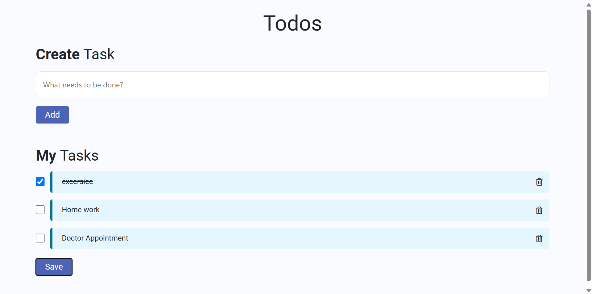

# To-Do List Web App

A simple and responsive web-based To-Do List application built using HTML, CSS, and JavaScript. Designed to help users manage their daily tasks effectively.

## Features

- Add new tasks
- Mark tasks as completed
- Delete tasks
- Fully responsive layout

## Technologies Used

- HTML5
- CSS3
- JavaScript (ES6)

## Screenshot

## How to Run

1. Clone this repository or download the ZIP.
2. Open the `index.html` file in any web browser.
3. Start adding your tasks!

## Author

Dinesh Kumar  
https://github.com/Dineshkumarreddyavula
